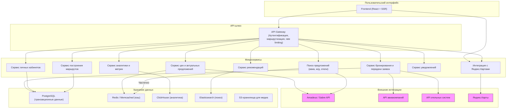

1. ==Архитектура и проектирование ПО - Тимур Лукин==

 Введение в архитектуру программного обеспечения

• Тимур рассказывает о проектировании и архитектуре программного обеспечения.
• Стив Макконнелл сравнивает разработку ПО с строительством зданий.
• Архитектура ПО интерпретируется как абстрактное описание системы.

 Определение архитектуры ПО

• Архитектура ПО пришла из теории строительства.
• Архитектура описывает крупные части системы без деталей.
• Архитектор решает, что будет сложно изменить в будущем.

 Роль архитектора

• Архитектор дополняет требования техническими деталями.
•Архитектор описывает самые важные классы и функции
![[Pasted image 20250226113847.png]]
• Архитектура включает компоненты системы и их взаимодействие.
• Архитектор описывает систему на языке пользователя.

 Примеры архитектуры

• Архитектура может включать описание системы без деталей.
• Архитектор прописывает прототипы классов и функций.
• Организация данных решается на уровне архитектуры.

 Организация данных

• Решается, какие данные будут храниться и как.
• Выбирается способ хранения данных, включая СУБД.
• Архитектор составляет схему базы данных.

 Структура пользовательского интерфейса

• Архитектор описывает основные компоненты интерфейса.
• Дизайнер реализует внешний вид интерфейса.
• Архитектор выделяет основные компоненты интерфейса.

 Обработка исключительных ситуаций

• Архитектор решает, как система обрабатывает сбои.
• Планируется восстановление после сбоев.
• Важно продумать, как система будет справляться с ошибками и с какими ошибками она может потенциально столкнуться

 Безопасность и использование технологий

• Архитектор должен продумать безопасность системы.
• Использование сторонних технологий обосновывается.
• Архитектор объясняет, почему выбраны определенные технологии.

 Ресурсы и развитие системы

• Архитектор оценивает человеческие и машинные ресурсы.
• Планируется, сколько людей и машин потребуется для реализации системы.
• Архитектор должен предусмотреть способы развития системы.

 Архитектура и тестирование

• Архитектор должен объяснить, как менять систему, если это потребуется.
• Важно обсудить с тестировщиками, что и как тестировать.
• Тестируемость системы должна быть определена на уровне архитектуры.

 Методологии и формы архитектуры

• Архитектура может быть представлена в виде бумаг, рисунков или кода.
• Методология определяет, как должна выглядеть работа архитектора.
• В IBM архитектура оформляется в виде кипы бумаг, в других компаниях – в виде рисунков или кода.

 Роль архитектора

• Архитектор нужен для построения сложных систем, как и для строительства зданий.
• В небольших проектах архитектор может быть одним из разработчиков.
• Архитектор должен иметь опыт и уметь работать с абстракциями.

 Опыт и обучение

• Архитектор должен иметь опыт участия в крупных проектах.
• Опыт можно получить, проектируя и разрабатывая архитектуры.
• Важно начинать с малых проектов и учиться на ошибках.

 Типовые решения и шаблоны

• Архитектура включает типовые решения и шаблоны.
• Шаблоны проектирования помогают решать конкретные задачи.
• Алгоритмы также являются типовыми решениями.

 Концепция слоев

• Архитектура делится на три большие части: представление, бизнес-логика и реализация.
• Представление отвечает за интерфейс и взаимодействие с пользователем.
• Бизнес-логика и реализация обеспечивают функциональность системы.
•Представление (пользователь видит как у нас что происходит **Интерфейсная часть**) , Домен ( или же бизнес-логика, отвечает за всю функциональность и все то что делает наша система), Источник ( часть системы, отвечающая за работу с субд)
 Домен и бизнес-логика

• Домен отвечает за основную функциональность системы.
• Слои обеспечивают изоляцию, позволяя изменять функциональность без влияния на соседние слои.
• Концепция слоев экономит время и ресурсы.

Шаблоны домена

• Рассматриваются три шаблона: сценарий транзакции, модель предметной области и слой служб.
• Сценарий транзакции использует императивный подход и описывает осмысленные действия.
• Модель предметной области использует объектно-ориентированный подход и описывает объекты физического мира.

Преимущества и недостатки шаблонов

• Сценарий транзакции прост в реализации, но сложен для описания сложной логики.
• Модель предметной области обеспечивает хорошую изоляцию, но может быть сложной в реализации и неэффективной.
• Слой служб сочетает сценарий транзакции и модель предметной области, что усложняет реализацию, но улучшает изоляцию.

 Шаблоны источника данных

• Шлюз таблицы данных и шлюз записи данных обеспечивают изоляцию между слоем домена и источником данных.
• Преобразователь данных синхронизирует данные между слоем домена и источником данных, преобразуя объекты.

 Шаблоны источника данных

• Шаблоны источника данных сложны и редко пишутся самостоятельно.
• Они используются для объединения объектов реального мира и реляционных СУБД.
• Если не нужны сложные преобразователи данных, лучше использовать объектно-ориентированные СУБД, такие как MongoDB.

 Шаблоны представления

• Шаблоны представления включают презенташн и вью.
• Модул вью-контроллер MVC популярен в веб-разработке.
• Модель представления контроллера MVC вызывает споры среди архитекторов и программистов.

Модель представления контроллера

• Модель - это элемент домена, представление - способ отображения данных пользователю.
• Контроллер выбирает подходящую модель и представление на основе запроса пользователя.
• Контроллер наполняет представление моделью и передает его пользователю.

Контроллеры

• Контроллеры бывают двух типов: контроллер страницы и контроллер запросов.
• Контроллер страницы обрабатывает запросы и возвращает страницу, вся логика находится в странице.
• Плюсы: простота, хорошая изоляция. Минусы: плохая гибкость, быстрый рост числа страниц.
• Контроллер запросов разбирает запрос, выбирает модель и представление, реализует бизнес-логику.
• Плюсы: высокая гибкость. Минусы: сложность реализации, плохая изоляция, часто перегружается бизнес-логикой.

 Шаблоны представления

• Представление по шаблону: встраивание кода в HTML-страницу для выполнения сложных задач.
• Плюсы: гибкость, наглядность написания. Минусы: доступность скриптлетов, сложность верстки, побочные эффекты.
• Представление с преобразованием: контроллер получает описание реального мира и преобразует его в HTML.
• Плюсы: независимость представления от модели, отличная изоляция, отсутствие дублирования кода.
• Минусы: сложность верстки, необходимость знания языка разметки.

 Архитектурные шаблоны

• Архитектурные шаблоны Мартина Фаулера.
• Алгоритмы: важность для программистов, но редко используются в реальных задачах.
• Книги для изучения алгоритмов: "Искусство программирования" Дональда Кнута, "Алгоритмы и структуры данных" Вирта Никлауса, "Алгоритмы и структуры данных" Кормена.

 Книга по программированию

• Книга полезна как справочник, особенно для изучения алгоритмов.
• Содержит задачи и их разбор, что помогает в интерактивном изучении.
• Написана на языке Паскаль, который легко перевести на другие языки.

 Шаблоны проектирования

• Шаблоны проектирования связаны с архитектурными шаблонами и парадигмами.
• Книга "Банды четырех" описывает дизайн-паттерны для C++ и C#.
• Некоторые паттерны бесполезны для других языков, так как в них уже есть встроенные решения.

 Пример паттерна "Синглтон"

• Паттерн "Синглтон" позволяет создать только один объект класса.
• В Python это достигается через наследование от класса "Синглтон".
• Пример: создание двух объектов, которые ссылаются на один и тот же объект.

 Шаблоны проектирования в FP

• FP шаблоны основаны на теории обработки сигналов.
• Программы можно свести к последовательности четырех действий: генерация, фильтрация, преобразование и свертка.
• Пример: функция "ренч" в Python, которая фильтрует список чисел, оставляя только нечетные.
 Применение FP шаблонов

• Преобразование и свертка используются для создания сложных функций.
• Пример: суммирование квадратов нечетных чисел от 1 до 100.
• FP шаблоны помогают структурировать программы и избегать дублирования кода.

 Архитектура и проектирование

• Архитектура важна в программировании, особенно при создании больших программ.
• Проектирование включает формулировку требований и архитектуру.
• Начинать лучше с маленьких программ, чтобы получить опыт и научиться проектировать.

Заключение

• Важно думать о проектировании даже при создании маленьких программ.
• Практика и размышления помогают улучшить навыки проектирования.
• Лекция завершается благодарностью за внимание.

==**MAIN-POINTS статьи** https://dev.to/lanars_inc/web-application-architecture-best-practices-and-guides-35e==

Статья «Web Application Architecture: Best Practices and Guides» на платформе DEV Community посвящена ключевым аспектам архитектуры веб-приложений, рассматривая различные подходы и предоставляя рекомендации по выбору оптимальной структуры для  проекта.

**Понимание архитектуры веб-приложений**

Архитектура веб-приложения описывает высокоуровневую структуру цифрового продукта, включая взаимодействие между его компонентами, способ хранения данных и обработку запросов на сервере. Качество архитектуры напрямую влияет на надежность, производительность и безопасность приложения.

**Значение правильного выбора архитектуры**

Правильный выбор архитектуры на начальном этапе разработки обеспечивает:

- **Безопасность и стабильность:** Защита данных и устойчивость к сбоям.
- **Скорость обработки запросов:** Быстрая реакция на пользовательские действия.
- **Масштабируемость:** Возможность адаптации к росту числа пользователей и увеличению нагрузки.
- **Понятность кода и повторное использование компонентов:** Упрощение разработки и сопровождения.
**Монолитная vs. Микросервисная архитектура**

Существует два основных подхода к архитектуре веб-приложений:

- **Монолитная архитектура:** Подходит для небольших продуктов с простой функциональностью и низкой посещаемостью, таких как блоги или приложения для конвертации валют. Преимущества включают простоту разработки и низкие затраты. Однако резкие всплески трафика могут привести к сбоям из-за ограниченных возможностей серверов. 
    
- **Микросервисная архитектура:** Рекомендуется для крупных или сложных продуктов, предполагающих регулярное обновление функциональности и масштабирование, например, социальных сетей. Каждый сервер отвечает за отдельную функцию (например, обмен сообщениями, загрузка файлов), что позволяет легко добавлять новые компоненты и исправлять ошибки без остановки всей системы. 
    

**Лучшие практики для высокопроизводительных веб-приложений**

Для обеспечения стабильности и эффективности веб-приложения рекомендуется:

- **Масштабируемость:** Использовать горизонтальное масштабирование, кеширование и балансировку нагрузки для равномерного распределения трафика и предотвращения сбоев при высоких нагрузках. 
    
- **Безопасность:** Шифровать данные, использовать HTTPS, внедрять надежные методы аутентификации и регулярно проводить аудиты безопасности для защиты от киберугроз. 
    
- **Оптимизация производительности:** Применять асинхронную обработку, использовать современные протоколы передачи данных и серверное кеширование для ускорения загрузки и снижения нагрузки на сервер. 
    
- **Устойчивость к сбоям:** Внедрять механизмы предотвращения каскадных отказов, использовать очереди сообщений для декуплинга сервисов и проводить тестирование на отказоустойчивость для обеспечения непрерывной работы приложения. 
    

Следуя этим рекомендациям, вы сможете разработать веб-приложение с надежной и гибкой архитектурой, готовой к изменяющимся требованиям и росту нагрузки.

==**АРХИТЕКТУРА ВЕБ-СЕРВИСА ЯНДЕКС ПУТЕШЕСТВИЯ**==
Архитектура веб-сервиса уровня **Яндекс.Путешествия** — это сложная, высоконагруженная система, построенная с учетом масштабируемости, надежности, высокой доступности и быстрого отклика. Хотя точных публичных схем архитектуры Яндекс не раскрывает, на основе общих принципов построения сервисов Яндекса, интервью их инженеров и открытых докладов можно описать примерную структуру архитектуры Яндекс.Путешествия.

---

## 1. **Общий принцип архитектуры**

Это **микросервисная архитектура**, которая включает:

- Множество микросервисов, каждый из которых отвечает за отдельную функцию (поиск авиабилетов, отелей, ЖД-билетов, формирование маршрутов, рекомендации, аналитика).
- Оркестрацию через Kubernetes и управление сервисами на базе собственной инфраструктуры Яндекс.

---

## 2. **Основные слои архитектуры**

### 2.1. **Frontend**

- Реализован с использованием React или собственного фреймворка (так как Яндекс разрабатывает собственные UI-инструменты).
- Активно используется SSR (Server Side Rendering) для ускорения загрузки страниц.
- Динамические страницы обновляются через WebSockets или long polling для отображения актуальных цен.

---

### 2.2. **API Gateway**

- Принимает запросы от фронтенда.
- Выполняет маршрутизацию к нужным микросервисам.
- Включает слои:
    - Аутентификации и авторизации
    - Rate limiting
    - Логирования и мониторинга запросов

---

### 2.3. **Основные микросервисы**

| Сервис                       | Функционал                                                                    |
| ---------------------------- | ----------------------------------------------------------------------------- |
| **Search Engine Service**    | Поиск авиабилетов, отелей, ж/д и автобусов с агрегацией данных от партнеров   |
| **Pricing & Offers Service** | Работа с ценами, скидками, кэширование и отображение актуальных предложений   |
| **Recommendations Service**  | Модуль рекомендаций (маршруты, интересные направления, динамические подборки) |
| **Route Planning Service**   | Создание сложных маршрутов (мультистоп, оптимизация)                          |
| **User Profile Service**     | Личный кабинет, история заказов, сохраненные маршруты                         |
| **Geo & Map Service**        | Интеграция с Яндекс.Картами, отображение маршрутов и направлений              |
| **Booking Service**          | Передача бронирования во внешние системы и интеграция с партнерами            |
| **Notification Service**     | Отправка email-уведомлений, push-оповещений, напоминаний                      |
| **Analytics & Logging**      | Отслеживание поведения пользователей, анализ конверсий, внутренние метрики    |

---

### 2.4. **Базы данных и хранилища**

- PostgreSQL и ClickHouse для аналитики и хранения транзакционных данных.
- Redis и Memcached для кэширования запросов и цен.
- S3-совместимые хранилища для медиа и резервов.
- Elasticsearch для полнотекстового поиска по направлениям, отелям, городам.

---

### 2.5. **Интеграции**

- Подключение к внешним агрегаторам (Sabre, Amadeus, Travelport) через API.
- Прямые интеграции с авиакомпаниями, отельными сетями и ЖД-системами.
- Интеграция с Яндекс.Картами для отображения маршрутов и точек.
- Интеграция с Яндекс ID для авторизации.

---

## 3. **Масштабирование и отказоустойчивость**

- **Kubernetes** + собственная облачная инфраструктура (Yandex Cloud или внутренние дата-центры).
- Горизонтальное масштабирование микросервисов.
- Логи распределяются в Yandex Logging System или аналогичное хранилище.
- Отказоустойчивость через репликацию баз данных и резервное копирование.

---

## 4. **Мониторинг и аналитика**

- Используются собственные решения (Yandex Monitoring), а также Grafana и Prometheus для внутренних дашбордов.
- Логирование с помощью Yandex ClickHouse и Kibana для визуализации.

---

## 5. **Поток запроса (упрощенный пример)**

**Пользователь** ➡ **Фронтенд (React + SSR)** ➡ **API Gateway** ➡ **Search Service** + **Pricing Service** ➡ **Сбор предложений** ➡ **Кэш** ➡ **Рекомендации + карта** ➡ Ответ пользователю.

---

## 6. **Резюме**

Архитектура Яндекс.Путешествия — это:

- Микросервисная архитектура с большим количеством специализированных сервисов
- Интеграция с международными и локальными системами бронирования
- Постоянный пересчет цен и маршрутов в реальном времени
- Отказоустойчивость и масштабируемость, позволяющие выдерживать миллионы запросов ежедневно

---

**Монолитная архитектура**

**Описание:**
Всё приложение собрано в едином блоке: пользовательский интерфейс, бизнес-логика и работа с базой данных находятся в одном процессе. Это традиционный подход к разработке программного обеспечения.

 **Преимущества:**
- Простота разработки: всё находится в одном месте, нет необходимости настраивать сложные связи между компонентами.
- Легкость тестирования: можно запустить весь проект одним файлом.
- Быстрый старт: не нужно беспокоиться о микросервисах или распределённых системах.

**Недостатки:**
- Сложность масштабирования: если нагрузка на одну часть системы растёт, придётся увеличивать мощности всей системы.
- Зависимости: изменения в одной части могут повлиять на остальные.
- Медленное обновление: при изменении одного компонента нужно пересобирать и развёртывать всё приложение.

  

 **Микросервисная архитектура**
 
 **Описание:**

Приложение разбито на множество независимых сервисов, каждый из которых отвечает за свою функциональность (например, управление задачами, поиск, ИИ). Эти сервисы взаимодействуют через API.

**Преимущества:**
- Гибкость: каждый сервис можно развивать и масштабировать независимо.
- Изоляция: проблема в одном сервисе не влияет на другие.
- Возможность использования разных технологий для разных сервисов.

 **Недостатки:**
- Сложность разработки: нужно уметь работать с распределёнными системами, сетевыми протоколами и базами данных.
- Требует больше времени: настройка инфраструктуры (Docker, Kubernetes) может занять много времени.
- Усложняет тестирование: нужно тестировать каждый сервис и их взаимодействие.

 **Клиент-серверная архитектура**
   **Описание:**

Система разделена на два компонента:

- **Клиентская часть:** Отвечает за пользовательский интерфейс (веб-страницы, мобильное приложение).

- **Серверная часть:** Обрабатывает запросы, работает с базой данных и выполняет бизнес-логику.

 **Преимущества:**
- Чёткое разделение ответственности: клиент занимается только UI, сервер — логикой.
- Масштабируемость: можно масштабировать серверную часть, не затрагивая клиентскую.
- Гибкость: можно добавлять новые клиентские платформы (например, мобильные приложения).

**Недостатки:**
- Требует знаний работы с сетями и API.
- Нужно настраивать взаимодействие между клиентом и сервером.

 **Event-driven архитектура**
 **Описание:**

Система работает на основе событий: один компонент отправляет события, а другие их обрабатывают. Например, когда пользователь создаёт задачу, система автоматически отправляет уведомление. 

 **Преимущества:**
- Реактивность: система может реагировать на любые события в режиме реального времени.
- Гибкость: легко добавлять новые компоненты, которые будут обрабатывать события.

 **Недостатки:**
- Сложность разработки: нужно понимать, как работают очереди сообщений (например, RabbitMQ, Kafka).
- Трудно отлаживать: сложно найти ошибки в сложных цепочках событий.

