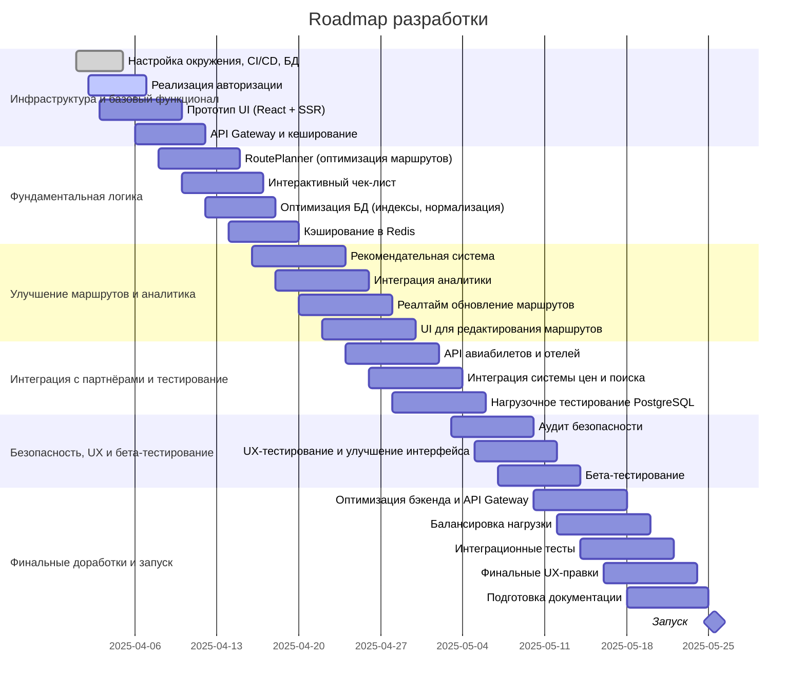

# Roadmap разработки  

```mermaid
gantt
    title Roadmap разработки
    dateFormat  YYYY-MM-DD
    section Инфраструктура и базовый функционал
    Настройка окружения, CI/CD, БД        :done, 2025-04-01, 2025-04-05
    Реализация авторизации                :active, 2025-04-02, 2025-04-07
    Прототип UI (React + SSR)             :2025-04-03, 2025-04-10
    API Gateway и кеширование             :2025-04-06, 2025-04-12

    section Фундаментальная логика
    RoutePlanner (оптимизация маршрутов)  :2025-04-08, 2025-04-15
    Интерактивный чек-лист                :2025-04-10, 2025-04-17
    Оптимизация БД (индексы, нормализация):2025-04-12, 2025-04-18
    Кэширование в Redis                   :2025-04-14, 2025-04-20

    section Улучшение маршрутов и аналитика
    Рекомендательная система              :2025-04-16, 2025-04-24
    Интеграция аналитики                  :2025-04-18, 2025-04-26
    Реалтайм обновление маршрутов         :2025-04-20, 2025-04-28
    UI для редактирования маршрутов       :2025-04-22, 2025-04-30

    section Интеграция с партнёрами и тестирование
    API авиабилетов и отелей              :2025-04-24, 2025-05-02
    Интеграция системы цен и поиска       :2025-04-26, 2025-05-04
    Нагрузочное тестирование PostgreSQL   :2025-04-28, 2025-05-06

    section Безопасность, UX и бета-тестирование
    Аудит безопасности                    :2025-05-03, 2025-05-10
    UX-тестирование и улучшение интерфейса:2025-05-05, 2025-05-12
    Бета-тестирование                     :2025-05-07, 2025-05-14

    section Финальные доработки и запуск
    Оптимизация бэкенда и API Gateway     :2025-05-10, 2025-05-18
    Балансировка нагрузки                 :2025-05-12, 2025-05-20
    Интеграционные тесты                  :2025-05-14, 2025-05-22
    Финальные UX-правки                   :2025-05-16, 2025-05-24
    Подготовка документации               :2025-05-18, 2025-05-25
    Запуск 🚀                             :milestone, 2025-05-25, 1d
```
